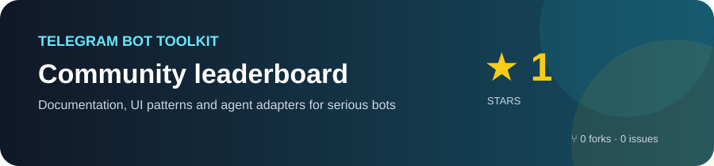

# Telegram Bot Toolkit

<div align="center">

### Official Telegram API knowledge for modern AI coding agents

[](https://core.telegram.org/bots/api)
[](references/agent-installation.md)
[](docs/START_HERE.md)



**Build bots that feel like products, not demos.**

[Install](#использование) · [Documentation](docs/START_HERE.md) · [Agent adapters](references/agent-installation.md) · [Design system](skills/telegram-bot-builder/references/interface-design.md)

</div>

Переносимая база официальной документации Telegram и начальный каркас плагина. Рабочее название можно изменить позже.

Снимок от 11 сентября 2026 года: сохранено 9 737 страниц и файлов из 9 740 обнаруженных адресов. Три старые ссылки TDLib возвращают HTTP 404; они перечислены в отчёте о покрытии. Bot API 10.3 дополнительно разбит на 601 раздел. Язык документации сохранён как в оригинале.

- [Начать здесь: основные разделы](docs/START_HERE.md)
- [Индекс документации](docs/INDEX.md)
- [Bot API по отдельным методам и типам](docs/bot-api/INDEX.md)
- [Отчёт о покрытии и ошибках](docs/coverage.json)
- [Манифест источников, дат и SHA-256](docs/manifest.json)
- [Результаты проверки файлов](docs/verification.json)
- [Навык для агентов](skills/telegram-docs/SKILL.md)
- [Навык разработки Telegram-ботов](skills/telegram-bot-builder/SKILL.md)
- [Руководство по дизайну интерфейса ботов](skills/telegram-bot-builder/references/interface-design.md)
- [Готовые шаблоны экранов](skills/telegram-bot-builder/references/screen-templates.md)
- [Машиночитаемый каталог экранов](skills/telegram-bot-builder/references/screen-catalog.json)
- [Генераторы для четырёх фреймворков](skills/telegram-bot-builder/references/framework-starters.md)
- [Набор из 53 custom emoji](skills/telegram-bot-builder/references/custom-emoji.json)
- [Обновление плагина и резервное копирование](references/updating.md)
- [Установка в AI-агенты, Cursor и GLM-среды](references/agent-installation.md)

В `docs/raw/` находятся оригинальные ответы сервера, в `docs/pages/` — Markdown для поиска и чтения. Ссылки внутри статей ведут на официальные источники; это справочный архив, а не полностью автономная визуальная копия сайта. Сохранены 9 632 HTML-страницы, 6 JSON-схем и 99 вложений, найденных по адресам `/file/`. Полное скачивание изображений, видео, стилей и прочих ресурсов сайта не выполнялось.

В `docs/supplemental/` дополнительно сохранены схемы `td_api.tl` и `telegram_api.tl`, README, CHANGELOG и лицензия официального репозитория TDLib. Их точный Git commit и контрольные суммы находятся в отдельном `manifest.json`. Скрипт обхода сайта эти дополнительные файлы не обновляет.

Обход охватывает доступные по ссылкам страницы `core.telegram.org` без query-параметров, включая Bot API, Mini Apps, платежи, Telegram API, MTProto, TDLib, Gateway, Passport и Widgets. Дополнительно включена страница Telegraph API. Исторические варианты с query-параметрами, внешние сайты и страницы без входящих ссылок не входят в гарантированное покрытие. Фактический результат смотрите в отчёте.

## Использование

Откройте эту папку агентом и попросите использовать `skills/telegram-docs/SKILL.md`. Перед работой навык проверяет последний GitHub Release. Укажите `TELEGRAM_BOT_TOOLKIT_REPO=owner/repo` или добавьте GitHub `origin`; при найденном релизе агент запускает проверенный установщик с резервной копией. `.codex-plugin/plugin.json` — манифест Codex.

Для подключения к нескольким агентам используйте `python scripts/install_agents.py --target all --project C:\path\to\bot`. Установщик создаёт адаптеры правил для Claude Code, Cursor, Gemini CLI, Cline, Roo Code, Continue, Windsurf, OpenCode, Aider и Codex без копирования 200+ MB документации.

Навык разработки спрашивает один раз, есть ли Telegram Premium у аккаунта-владельца бота в BotFather, и предлагает включить пользовательский набор custom emoji. Если Premium нет, агент проверяет альтернативное условие с дополнительным username на Fragment и иначе использует обычные Unicode emoji. У пяти переданных ID не было указано обычное emoji-содержимое; перед использованием агент должен получить его через `getCustomEmojiStickers`.

При проектировании пользовательского интерфейса агент обязан прочитать отдельное руководство. Оно описывает современный паттерн меню «одно редактируемое сообщение = один экран», обложки с подписями и inline-клавиатурами, цитаты и настоящие reply-цитаты, типографику Telegram, Rich Messages, Mini Apps, состояния интерфейса, доступность и финальную проверку качества.

Каталог экранов содержит готовую структуру `/start`, главного меню, профиля, настроек, каталога, карточки товара, оплаты, подтверждения, загрузки и ошибок. Он не привязан к конкретному фреймворку: агент адаптирует поля и обработчики под выбранный стек.

После изменения каталога его можно проверить командой `python skills/telegram-bot-builder/scripts/validate_screen_catalog.py`. Проверяются уникальность экранов, структура кнопок, лимит статических `callback_data`, положение платёжной кнопки и формат отключённых кнопок.

Генератор создаёт запускаемый проект для `aiogram`, `python-telegram-bot`, `telegraf` или `grammy`. Все варианты используют переменные окружения, редактируемое меню, необязательную обложку и переключаемые custom emoji.

Флаг `--production` добавляет Docker Compose с PostgreSQL и Redis, webhook-режим с секретным заголовком Telegram, SQL-схему для пользователей, состояния экранов и идемпотентности обновлений, локализацию RU/EN, healthcheck и тесты экранов.

Пример поиска из корня папки:

```sh
rg -n 'bots/api|webapps|gateway' docs/INDEX.md
rg -n 'sendMessage' docs/pages
```

## Повторная загрузка

```sh
python -m pip install -r requirements.txt
python scripts/sync_docs.py
python scripts/prepare_bot_reference.py
```

GitHub Actions в `.github/workflows/refresh-telegram-docs.yml` ежедневно проверяет контрольные суммы официальных страниц Telegram. При изменении он обновляет архив, прогоняет проверки, коммитит результат и публикует ZIP-релиз с SHA-256.

Успешно загруженные страницы используются из кеша. Для нового снимка скопируйте каркас и скрипт в новую папку без `docs/` и запустите там. Так предыдущий снимок останется доступен.

Документация принадлежит её исходным правообладателям. Адреса источников сохранены; собственная лицензия на материалы Telegram здесь не назначается.
